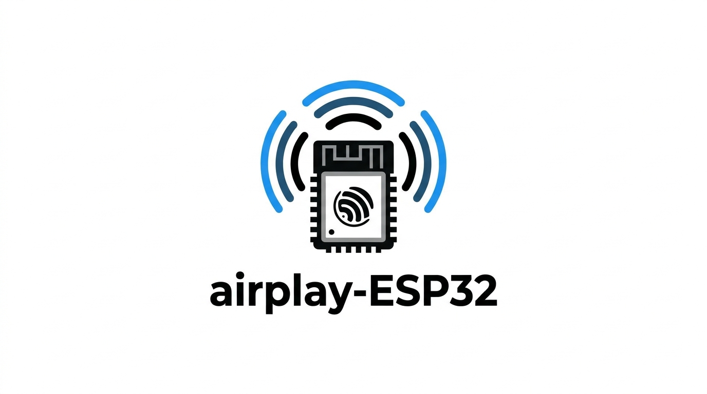
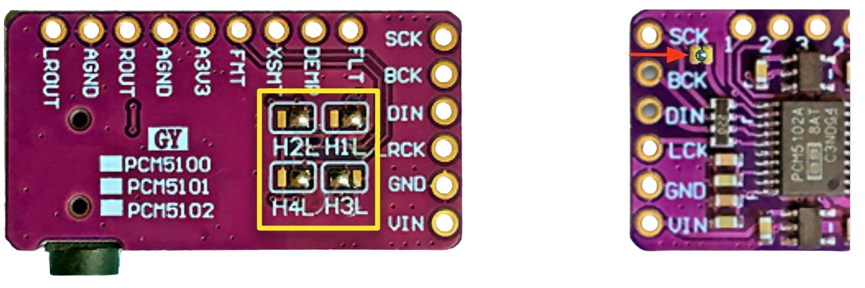
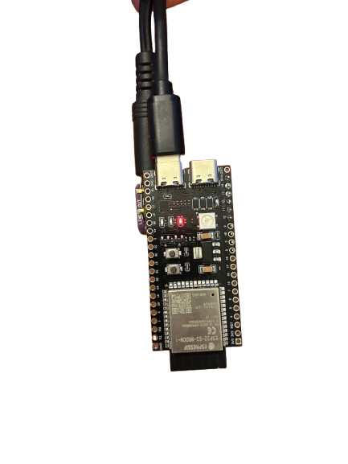
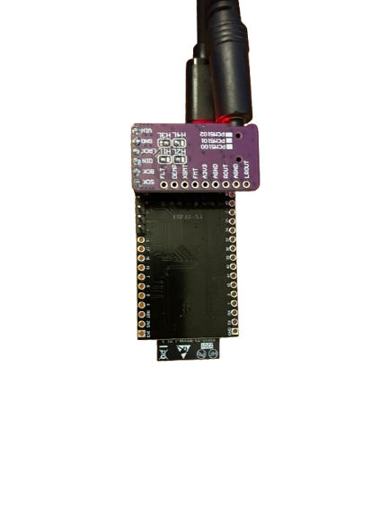
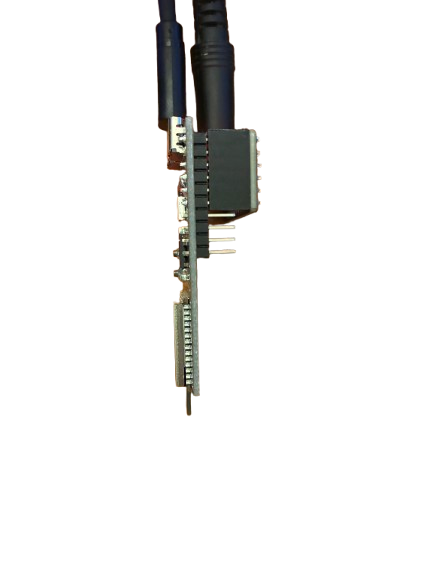
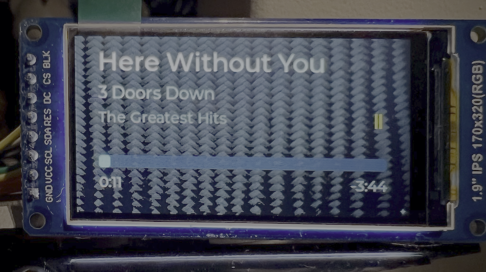

# ESP32 AirPlay 2 Receiver

[](https://github.com/rbouteiller/airplay-esp32/stargazers)
[](https://github.com/rbouteiller/airplay-esp32/network)
[](LICENSE)
[](https://docs.espressif.com/projects/esp-idf/)
[](https://www.espressif.com/en/products/socs/esp32)
[](https://www.espressif.com/en/products/socs/esp32-s3)
[](https://www.espressif.com/en/products/socs/esp32)
[](https://github.com/philippe44/SqueezeAMP)

**Stream music from your Apple devices — or phone via Bluetooth — to any speaker for ~10$**

</div>

---

## What is this?

This turns a cheap ESP32 board into a wireless AirPlay 2 speaker. Plug it into any amplifier or powered speakers, and it shows up on your iPhone/iPad/Mac just like a HomePod or AirPlay TV. Works with **ESP32**, **ESP32-S3**, and **ESP32-C5** chips, including the **[SqueezeAMP](https://github.com/philippe44/SqueezeAMP)** (ESP32 + TAS5756 DAC) and **[Esparagus Audio Brick](https://sonocotta.com/espragus-audio-brick/)** (ESP32 + TAS5825M DAC/amp) boards with built-in amplifiers.

ESP32 boards (SqueezeAMP, Esparagus Audio Brick) also support **Bluetooth A2DP** — stream from any phone or tablet over Bluetooth when AirPlay isn't in use. The Esparagus Audio Brick additionally supports **wired Ethernet** via an optional W5500 SPI module.

**No cloud. No app. Just tap and play.**

---

## Shopping List

You only need 2 boards and a few wires. Everything is available on AliExpress / Amazon for under 10$.

| Component                | What to search for                                                      | Price |
| ------------------------ | ----------------------------------------------------------------------- | ----- |
| **ESP32-S3 dev board**   | "ESP32-S3 N16R8"                                                        | ~5$   |
| **PCM5102A DAC board**   | "PCM5102A I2S DAC" (the small purple board with 3.5mm jack)             | ~3$   |
| **Female 2.54mm header** | "Female pin header 2.54mm single row" (1x6 or longer, then cut to size) | ~0.5$ |

> **Alternative:** If you have a **[SqueezeAMP](https://github.com/philippe44/SqueezeAMP)** or **[Esparagus Audio Brick](https://esparagus.com/)** board, you don't need a separate DAC — just flash the appropriate firmware target. See the [SqueezeAMP](#squeezeamp) and [Esparagus Audio Brick](#esparagus-audio-brick) sections below.

Here is what the PCM5102A board looks like:
Verify the solder bridges are in the same position as the picture.

<div align="center">

</div>

---

## Assembly (No Soldering Skills Needed)

The PCM5102A plugs directly onto the ESP32 pins using a female header — no breadboard, no jumper wires.

### Step 1 — Prepare the ESP32

The pins on **one side** of the ESP32 need to be removed (or not soldered on) so the assembly fits inside the 3D-printed case. Only the side with GPIO11–GPIO14 needs pins.

If your board came with pins on both sides already soldered, you can carefully desolder or clip the pins on the opposite side.

### Step 2 — Plug the DAC onto the ESP32

Take a **female 2.54mm pin header** (6 pins) and plug it onto the ESP32 pins on the side with GPIO11–14. Then insert the PCM5102A board into the female header from the other side.

The connections through the header are:

```
ESP32-S3 pin     →  PCM5102A pin    What it does
─────────────────────────────────────────────────
5V               →  VIN             Power for the DAC
GPIO11           →  BCK             Bit clock (audio timing)
GPIO12           →  DIN             Audio data
GPIO13           →  LCK             Left/right channel select
GPIO14           →  GND             Software ground (pulled low by code)
Or GND           →  GND             Ground (GPIO14 software ground is sufficient)
```

### _⚠️ **Important:** On the ESP32S3 board, bridge the VIN/VOUT solder pads if they are not already connected. This lets the board use 5V power directly._

### Step 3 — Check the result

Your assembly should look like this:

<div align="center">

|                              Front                              |                             Back                              |                              Side                               |
| :-------------------------------------------------------------: | :-----------------------------------------------------------: | :-------------------------------------------------------------: |
|  |  |  |

</div>

The PCM5102A sits on top of the ESP32 and the 3.5mm audio jack sticks out the end. Plug a USB-C cable into the ESP32 for power.

### Step 4 — (Optional) Print the case

A 3D-printable case is provided in [`docs/boite esp32.stl`](docs/boite%20esp32.stl). Print it with standard PLA settings. The case is designed for the assembly with pins on one side only.

---

## Flash the Firmware

Three options: **Web flasher** (no install needed), **PlatformIO**, or **ESP-IDF**.

### Option A — Web Flasher (Recommended for beginners)

Flash a pre-built firmware directly from your browser — no toolchain, no code, no command line.

1. Download the latest firmware from the [Releases page](https://github.com/rbouteiller/airplay-esp32/releases/latest):
   - **`airplay2-receiver-esp32s3.bin`** — for generic ESP32-S3 + PCM5102A
   - **`airplay2-receiver-squeezeamp.bin`** — for SqueezeAMP boards
   - **`airplay2-receiver-squeezeamp-bt.bin`** — for SqueezeAMP enabling Bluetooth
   - **`airplay2-receiver-squeezeamp-4m.bin`** — for SqueezeAMP with 4MB flash
   - **`airplay2-receiver-esparagus-audio-brick.bin`** — for Esparagus Audio Brick
   - **`airplay2-receiver-esparagus-audio-brick-bt.bin`** — for Esparagus Audio Brick enabling Bluetooth
2. Open the [ESP Web Flasher](https://espressif.github.io/esptool-js/) (requires Chrome or Edge)
3. Plug your ESP32 via USB-C, click **Connect** and select the serial port
4. Set the flash address to **`0x0`**, select the downloaded `.bin` file, and click **Program**
5. Once done, unplug and re-plug the board — it will boot into setup mode

> **Note:** The web flasher uses WebSerial, which is only supported in Chromium-based browsers (Chrome, Edge, Opera).

### Option B — PlatformIO

[PlatformIO](https://platformio.org/) handles all the toolchain setup for you.

```bash
# 1. Install PlatformIO CLI
pip install platformio

# 2. Clone this project (with submodules)
git clone --recursive https://github.com/rbouteiller/airplay-esp32
cd airplay-esp32

# 3. Plug in your ESP32 via USB-C and flash the firmware
pio run -e esp32s3 -t upload

# 4. Flash the SPIFFS image with the web UI and data files
pio run -e esp32s3 -t uploadfs

# 5. (Optional) Watch serial output for debugging
pio run -e esp32s3 -t monitor
```
> **Note:** PlatformIO does not flash the [SPIFFS Filesystem](#spiffs-filesystem) as part of `-t upload`; run `pio run -e esp32s3 -t uploadfs` after flashing firmware so the web UI and data files are present [[details](#flashing-the-spiffs-image)].


### Option C — ESP-IDF

```bash
# 1. Install ESP-IDF v5.x following:
#    https://docs.espressif.com/projects/esp-idf/en/latest/esp32/get-started/

# 2. Clone and enter the project (with submodules)
git clone --recursive https://github.com/rbouteiller/airplay-esp32
cd airplay-esp32

# 3. Activate ESP-IDF environment
source /path/to/esp-idf/export.sh

# 4. Build and flash incl. SPIFFS "storage" partition from data/
idf.py set-target esp32s3
idf.py build
idf.py -p /dev/ttyUSB0 flash

# 5. (Optional) Monitor serial output
idf.py -p /dev/ttyUSB0 monitor
```

---

## Custom Board Configuration

If you're porting to your own hardware, you can create a **`user_platformio.ini`** file to define a custom build environment without modifying the main `platformio.ini`. This file is already included via `extra_configs` in the main config, so PlatformIO picks it up automatically.

### How It Works

1. Pick an existing environment to extend (e.g. `esp32s3`, `esp32wrover-dev`)
2. Create a `sdkconfig.user.<your_board>` file with your board-specific Kconfig overrides (GPIO pins, DAC selection, display settings, etc.)
3. Add an environment in `user_platformio.ini` that chains your sdkconfig file after the base defaults

### Example

Say you have a custom ESP32 board called "myboard" with a SqueezeAMP-compatible DAC but different GPIO assignments and an OLED display. Create two files:

**`sdkconfig.user.myboard`** — your board-specific overrides:

```ini
# I2S pin assignments
CONFIG_I2S_BCK_PIN=5
CONFIG_I2S_WS_PIN=18
CONFIG_I2S_DO_PIN=19

# Enable OLED display
CONFIG_DISPLAY_ENABLED=y
CONFIG_DISPLAY_I2C_SDA=21
CONFIG_DISPLAY_I2C_SCL=22
```

**`user_platformio.ini`** — your build environment:

```ini
[env:myboard]
extends = env:esp32s3
...
board_build.cmake_extra_args =
    "-DSDKCONFIG_DEFAULTS=sdkconfig.defaults;sdkconfig.defaults.esp32s3;sdkconfig.user.myboard"
```

Then build and flash:

```bash
pio run -e myboard -t upload
```

### Notes

- The sdkconfig defaults are applied **left to right** — later files override earlier ones, so your `sdkconfig.user.*` should come last
- `sdkconfig.user.*` files are gitignored (via the `sdkconfig.*` pattern), so they won't pollute the repo
- If you change any sdkconfig defaults, delete the cached `sdkconfig.<env>` file before rebuilding so the new values are picked up
- You can extend any base environment — use `squeezeamp` / `squeezeamp-bt` for TAS57xx boards, `esparagus-audio-brick` / `esparagus-audio-brick-bt` for TAS58xx boards, or `esp32s3` for S3-based boards

---

## Setup (First Boot)

1. **Power up** the ESP32 via USB-C
2. On your phone or laptop, connect to the WiFi network **`ESP32-AirPlay-Setup`**
3. A captive portal will open. (IP: 192.168.4.1)
4. Set a name for your speaker (e.g. "Kitchen Speaker")
5. Select your home WiFi network and set a password
6. The device restarts and connects to your WiFi
7. Open any music app, tap the AirPlay icon, and select your speaker

That's it! Settings are saved and persist across reboots.

> **If WiFi connection fails** after several retries, the ESP32 automatically goes back into setup mode so you can reconfigure it.

---

## Updating the Firmware (OTA)

Once the device is connected to your WiFi, you can update the firmware wirelessly without unplugging anything:

1. Build the new firmware (`idf.py build` or `pio run`)
2. Open the device's web interface (find its IP in your router's connected devices list)
3. Use the firmware upload page to flash the new version

---

## SPIFFS Filesystem

The firmware uses a **SPIFFS partition** on flash to store web pages and DAC configuration files. This means you can update web UI pages and hybrid flow DSP programs without recompiling the firmware.

### Partition Layout

A `storage` partition is added to the partition table:

| Board | Partition Size | Address |
|---|---|---|
| SqueezeAMP (8+MB) | 316 KB | 0x5B1000 |
| SqueezeAMP 4M | 192 KB | 0x3D1000 |

The SPIFFS partition is mounted at `/spiffs` on boot.

### Data Directory

The `data/` directory in the project root contains the files that get flashed to the SPIFFS partition:

```
data/
├── www/               # Web interface pages
│   ├── index.html     # Main setup / control panel
│   ├── logs.html      # Live log viewer
│   └── eq.html        # Equalizer page (Esparagus Audio Brick)
└── hf/                # Hybrid flow DSP programs (SqueezeAMP)
    └── tas57xx_fw.bin # Provide this file for hybrid flow support on TAS575xM DACs
```

### Flashing the SPIFFS Image

**First time (serial only):** The partition table changes, so the first flash after upgrading must be done over serial — OTA won't work because the old partition layout doesn't include the storage partition.

```bash
# PlatformIO: flash firmware first, then the SPIFFS image from data/
pio run -e squeezeamp-bt -t upload
pio run -e squeezeamp-bt -t uploadfs

# ESP-IDF: flash firmware + partition table + SPIFFS image in one step
idf.py -p /dev/ttyUSB0 flash
```

**Subsequent updates:** After the partition table is in place, you can update individual files over WiFi using the file management API (see below), or re-flash the full SPIFFS image over serial.

### OTA File Management API

Three HTTP endpoints let you manage SPIFFS files over WiFi without reflashing:

**Upload a file:**
```bash
curl -X POST "http://<device-ip>/api/fs/upload?path=/spiffs/hf/my_flow.bin" \
     --data-binary @my_flow.bin
```

**Delete a file:**
```bash
curl -X POST "http://<device-ip>/api/fs/delete?path=/spiffs/hf/old_flow.bin"
```

**List files in a directory:**
```bash
curl "http://<device-ip>/api/fs/list?dir=/spiffs/hf"
```

Paths are restricted to `/spiffs/` and directory traversal (`..`) is rejected. Maximum upload size is 64 KB.

### Hybrid Flow Configuration (SqueezeAMP)

The TAS575xM DAC supports **hybrid flow** DSP programs that run on the chip's miniDSP core. At boot, the driver checks for `/spiffs/hf/tas57xx_fw.bin` and loads it automatically if present. No menuconfig setting is needed — just place the file and reboot.

**To add or update a hybrid flow:**

1. Export a `.cfg` file from TI PurePath Console
2. Convert to binary: `python3 components/dac_tas57xx/hybridflows/convert_cfg.py --bin my_flow.cfg`
3. Rename the output to `tas57xx_fw.bin`
4. Copy to `data/hf/` (for serial flash) or upload via the API:
   ```bash
   curl -X POST "http://<device-ip>/api/fs/upload?path=/spiffs/hf/tas57xx_fw.bin" \
        --data-binary @tas57xx_fw.bin
   ```
5. Reboot the device

To disable the hybrid flow, delete the file (or don't include one in the SPIFFS image).

> **Note:** Hybrid flows are only available to TAS575xM chips. The driver detects the chip family at boot and skips HF loading on TAS578x devices.

---

## SqueezeAMP

The **[SqueezeAMP](https://github.com/philippe44/SqueezeAMP)** is an ESP32-based board with a TAS5756 DAC and built-in Class-D amplifier. No external DAC needed — just connect speakers directly.

### Flashing

```bash
# PlatformIO
pio run -e squeezeamp -t upload

# ESP-IDF
idf.py set-target esp32
idf.py build
idf.py -p /dev/ttyUSB0 flash
```

`idf.py flash` also writes the SPIFFS `storage` partition populated from `data/`, so the captive-portal pages are available after first boot.

The SqueezeAMP build selects the TAS57xx DAC driver automatically via Kconfig (`CONFIG_DAC_TAS57XX`) and configures the correct I2S/I2C pins. Buffer sizes are automatically reduced (2500 frames vs 5000) to fit the ESP32's more limited PSRAM access.

A 4MB flash variant is also supported (`squeezeamp-4m` PlatformIO environment).

### Bluetooth Build

To build with Bluetooth A2DP support:

```bash
# PlatformIO
pio run -e squeezeamp-bt -t upload
```

See the [Bluetooth A2DP](#bluetooth-a2dp) section for details.

---

## Esparagus Audio Brick

The **[Esparagus Audio Brick](https://github.com/sonocotta/esparagus-media-center/?tab=readme-ov-file#esparagus-audio-brick-prototype)** is an ESP32-based board with a **TI TAS5825M** Class-D DAC/amplifier. Like the SqueezeAMP, no external DAC is needed — connect speakers directly to the board.

### Features

- TAS5825M with on-chip DSP and 15-band parametric EQ (25 Hz – 16 kHz)
- Hardware volume control with configurable max level
- Speaker fault detection with automatic mute/recovery
- Automatic power state management (deep sleep / standby / play) based on AirPlay session state
- 8 MB flash
- Optional **Bluetooth A2DP** — receive audio from phones/tablets over Bluetooth
- **W5500 SPI Ethernet** — wired network connection with automatic WiFi failover

### Flashing

```bash
# PlatformIO (AirPlay only)
pio run -e esparagus-audio-brick -t upload

# PlatformIO (AirPlay + Bluetooth)
pio run -e esparagus-audio-brick-bt -t upload

# Monitor serial output
pio run -e esparagus-audio-brick -t monitor
```

### Default GPIO Assignments

| Function      | GPIO | Notes                            |
| ------------- | ---- | -------------------------------- |
| I2S BCK       | 26   | Bit clock                        |
| I2S WS        | 25   | Word select (LRCLK)              |
| I2S DO        | 22   | Serial audio data                |
| I2C SDA       | 21   | DAC control (TAS5825M)           |
| I2C SCL       | 27   | DAC control (TAS5825M)           |
| Jack detect   | 34   | Headphone jack insertion (input) |
| DAC warning   | 36   | TAS5825M warning output (input)  |
| Speaker fault | 39   | TAS5825M fault output (input)    |

> GPIOs 34–39 on ESP32 are input-only with no internal pull-up. The board provides external pull-ups on the fault and warning lines.

The build selects the TAS58xx DAC driver automatically (`CONFIG_DAC_TAS58XX`). The driver auto-detects the TAS5825M I2C address (0x4C–0x4F) at startup.

### Bluetooth Build

To build with Bluetooth A2DP support:

```bash
pio run -e esparagus-audio-brick-bt -t upload
```

See the [Bluetooth A2DP](#bluetooth-a2dp) section for details.

### Ethernet (W5500)

The Esparagus Audio Brick supports wired Ethernet via an external W5500 SPI module. This is enabled by default in the `esparagus-audio-brick-bt` build environment.

See the [Ethernet (W5500)](#ethernet-w5500) section for details.

---

## Bluetooth A2DP

ESP32-based boards (SqueezeAMP, Esparagus Audio Brick) can also receive audio over **Bluetooth Classic A2DP**. This lets any phone, tablet, or laptop stream music via Bluetooth — no Apple device required.

Bluedroid Bluetooth stack is used for A2DP support. The device appears as a standard Bluetooth speaker with AVRCP metadata and volume control. It is very tight on RAM and flash.

### How It Works

- AirPlay and Bluetooth coexist but are **mutually exclusive at runtime**
- When a BT device connects, AirPlay is automatically suspended
- When the BT device disconnects, AirPlay resumes
- BT discoverability is disabled during active AirPlay sessions to prevent interruptions
- AVRCP support for volume sync and track metadata (artist, title, album) on the OLED display
- BT volume is saved to NVS and restored on reconnect

### Pairing

The device appears as a Bluetooth speaker with the same name as your AirPlay device name (set via the web interface). Pairing uses a fixed PIN code (default: `05032026`, configurable via `idf.py menuconfig` → Bluetooth Configuration).

Secure Simple Pairing (SSP) can optionally be enabled for BT 2.1+ devices — this uses numeric confirmation instead of a PIN. SSP requires a display to show the confirmation number. This is not implemented on the display yet.

### Build Environments

| Environment | Board | Features |
|---|---|---|
| `squeezeamp-bt` | SqueezeAMP | AirPlay + Bluetooth |
| `esparagus-audio-brick-bt` | Esparagus Audio Brick | AirPlay + Bluetooth + Ethernet |
| `esp32c5-xiao` | Seeed XIAO ESP32-C5 | AirPlay (dual-band WiFi 6, no Bluetooth) |

> **Note:** Bluetooth Classic is only available on the original ESP32 (not ESP32-S3). The ESP32-S3 generic build does not include Bluetooth support.

> **Note:** The Seeed XIAO ESP32-C5 (RISC-V, 8 MB flash, 8 MB PSRAM) is dual-band WiFi 6 with Bluetooth LE only — it has no Bluetooth Classic, so A2DP is not available. The official `platformio/espressif32` platform does **not** support the ESP32-C5, so the `esp32c5-xiao` environment uses the community [pioarduino](https://github.com/pioarduino/platform-espressif32) platform (pinned in `platformio.ini`), which bundles ESP-IDF 5.5.x. No extra setup is needed — PlatformIO downloads it automatically on first build. Alternatively, build with the ESP-IDF native flow: `idf.py set-target esp32c5` then `idf.py -DSDKCONFIG_DEFAULTS="sdkconfig.defaults;sdkconfig.defaults.esp32c5" build flash monitor`. Wire an external I2S DAC (e.g. PCM5102A) to the default pins: BCK=GPIO8 (D8), WS/LRCK=GPIO9 (D9), DIN=GPIO10 (D10); adjust via `idf.py menuconfig` → Board Configuration → Pin Configuration.

---

## Ethernet (W5500)

The Esparagus Audio Brick supports wired Ethernet via a **W5500 SPI Ethernet module**. This provides a reliable, low-latency network connection — useful in setups where WiFi is unreliable or unavailable.

### How It Works

- Ethernet is checked first at boot — if a cable is connected, WiFi is skipped entirely
- If the Ethernet cable is unplugged at runtime, WiFi automatically starts as a fallback (AP + STA mode)
- If the Ethernet cable is plugged back in, WiFi is stopped and Ethernet takes over
- The web interface shows "Ethernet" or "WiFi" depending on the active connection
- AirPlay and Bluetooth work identically on either interface

### Wiring

The W5500 module connects via SPI (shared bus with the OLED display):

| W5500 Pin | ESP32 GPIO | Function |
|---|---|---|
| CLK | GPIO 18 | SPI clock |
| MOSI | GPIO 23 | SPI data out |
| MISO | GPIO 19 | SPI data in |
| CS | GPIO 5 | Chip select |
| INT | GPIO 35 | Interrupt |
| RST | GPIO 14 | Hardware reset |
| 3V3 | 3.3V | Power |
| GND | GND | Ground |

### Configuration

Ethernet is enabled by default in the `esparagus-audio-brick-bt` build. The GPIOs can be changed via `idf.py menuconfig` → Board Configuration → SPI and Ethernet Configuration.

To disable Ethernet, set `CONFIG_ETH_W5500_ENABLED=n` in menuconfig. When disabled, all Ethernet code is compiled out — zero impact on flash size or RAM.

> **Note:** The W5500 has no factory MAC address. The firmware derives a unique MAC from the ESP32's base MAC using `ESP_MAC_ETH`, so each board gets a stable, unique Ethernet MAC.

---

## OLED Display (Optional)

You can connect a small OLED screen to show the currently playing track info — title, artist, album, a progress bar, and playback time. The display auto-scrolls long text and shows a pause indicator when playback is paused.

### Supported Displays

| Controller | Resolution | Bus     |
| ---------- | ---------- | ------- |
| SSD1306    | 128×64     | I2C/SPI |
| SH1106     | 128×64     | I2C/SPI |
| SSD1309    | 128×64     | I2C/SPI |

128×32 displays (SSD1306 / SH1106) are also supported — they use a compact two-line layout.

> These small OLED boards are widely available on AliExpress / Amazon for ~1–2$. Search for "0.96 inch OLED I2C SSD1306".

### Wiring (I2C — default)

| OLED Pin | ESP32 GPIO | Function  |
| -------- | ---------- | --------- |
| SDA      | GPIO 21    | I2C data  |
| SCL      | GPIO 22    | I2C clock |
| VCC      | 3.3V       | Power     |
| GND      | GND        | Ground    |

The default I2C address is `0x3C`. If your display uses `0x3D`, change it in `idf.py menuconfig` under **AirPlay Receiver → Display Configuration**.

### Enabling the Display

The display is **disabled by default**. To enable it:

#### ESP-IDF

```bash
idf.py menuconfig
# Navigate to: AirPlay Receiver → Display Configuration
# Enable "Enable OLED display"
# Select your driver (SSD1306, SH1106, or SSD1309)
# Select bus type (I2C or SPI) and set GPIO pins if needed
```

#### PlatformIO

Add `CONFIG_DISPLAY_ENABLED=y` and the relevant display options to your sdkconfig defaults, or run menuconfig:

```bash
pio run -e esp32s3 -t menuconfig
```

### Display Options

| Option           | Default   | Description                                 |
| ---------------- | --------- | ------------------------------------------- |
| Display driver   | SSD1306   | SSD1306 / SH1106 / SSD1309                  |
| Display height   | 64 pixels | 64 or 32 pixels                             |
| Bus type         | I2C       | I2C or SPI                                  |
| I2C SDA GPIO     | 21        | Data line (I2C mode)                        |
| I2C SCL GPIO     | 22        | Clock line (I2C mode)                       |
| I2C address      | 0x3C      | 7-bit address (0x3C or 0x3D)                |
| Flip display     | No        | Rotate output 180°                          |
| Refresh interval | 500 ms    | How often the display redraws (100–5000 ms) |

SPI mode exposes additional GPIO settings for CLK, MOSI, CS, DC, and RST.

---

## Hardware Buttons (Optional)

You can wire physical buttons to control playback directly from the device — no phone needed. Buttons work with both AirPlay and Bluetooth sources.

### AirPlay v1 Requirement

Button-driven remote control (play/pause, next/prev track) relies on **DACP** (Digital Audio Control Protocol) — a protocol where iOS sends a session ID and port that the receiver uses to send commands back to the source. **iOS only sends DACP headers in AirPlay v1 (classic) mode.** In AirPlay 2 mode, Apple uses MRP (Media Remote Protocol) instead, which is not implemented.

This means:

- **AirPlay 2 (default):** Volume buttons work (applied locally on the DAC), but play/pause and track skip **fall back to local mute** — they can't control the source device
- **AirPlay v1 (forced):** All buttons work fully — volume, play/pause, next/prev all control the source device via DACP
- **Bluetooth:** All buttons work fully via AVRCP passthrough regardless of AirPlay mode

To enable full button control over AirPlay, force AirPlay v1 mode:

```bash
idf.py menuconfig
# Navigate to: AirPlay Receiver → AirPlay Protocol
# Enable "Force AirPlay v1 (classic) protocol"
```

Or add to your sdkconfig defaults:

```
CONFIG_AIRPLAY_FORCE_V1=y
```

> **Trade-off:** AirPlay v1 disables AirPlay 2 features (HomeKit pairing, encrypted transport, multi-room sync). The device still appears in AirPlay menus on iOS but as a classic receiver. Bluetooth is unaffected.

### Supported Actions

| Button       | Action                                        |
| ------------ | --------------------------------------------- |
| Play/Pause   | Toggle playback                               |
| Volume Up    | Increase volume (~3 dB step, auto-repeat)     |
| Volume Down  | Decrease volume (~3 dB step, auto-repeat)     |
| Next Track   | Skip to next track                            |
| Previous     | Go to previous track                          |

Volume buttons support **auto-repeat**: hold for 500 ms and the action repeats every 200 ms.

### How It Works

- Buttons are **active-low** — wire between the GPIO and GND (no external resistor needed for most GPIOs)
- Internal pull-ups are enabled automatically on GPIOs 0–33
- GPIOs 34–39 (input-only on ESP32) require an **external pull-up resistor** — the driver warns at boot if these are used
- Interrupt-driven with 50 ms software debounce — no polling overhead
- Actions are dispatched to the active source: DACP commands for AirPlay 1, AVRCP passthrough for Bluetooth

### Wiring

```
ESP32 GPIO ──┤ ├── GND
           (button)
```

No resistor needed — the internal pull-up keeps the pin high when the button is open.

### Configuration

All button GPIOs default to `-1` (disabled). To enable buttons:

```bash
idf.py menuconfig
# Navigate to: AirPlay Receiver → Button Configuration
# Set each GPIO pin, or leave at -1 to disable
```

Or with PlatformIO:

```bash
pio run -e <env> -t menuconfig
```

| Option                | Default | Description                  |
| --------------------- | ------- | ---------------------------- |
| Play/Pause button GPIO | -1     | GPIO for play/pause          |
| Volume Up button GPIO  | -1     | GPIO for volume up (repeats) |
| Volume Down button GPIO | -1    | GPIO for volume down (repeats) |
| Next Track button GPIO | -1     | GPIO for next track          |
| Previous Track button GPIO | -1 | GPIO for previous track      |

> **Note:** The button driver automatically installs the shared GPIO ISR service (`board_gpio_isr_init()`) if it hasn't been set up already by the board support layer.

---

## ST7789 TFT Display (Optional)

A 320×170 colour TFT display can be connected to show track metadata with a progress bar on a full-colour background. Uses [LVGL 9](https://lvgl.io/) + `esp_lvgl_port` for rendering. The display is **disabled by default** and must be explicitly enabled.

<div align="center">

</div>

> For wiring, enabling instructions, background image customisation, and implementation notes see the [Display Component README](components/display/README.md).

---

## AirPlay Tuning (Optional)

Advanced timing and metadata options under **AirPlay Receiver → AirPlay Protocol** in `menuconfig`. The defaults are sensible for most setups — only change these if you hear drop-outs or want to control what metadata is received.

### Cover Art / Artwork

Album cover art is **disabled by default**. Most receivers have no screen (or only a small OLED), and receiving artwork images over the RTSP connection can stall the audio pipeline and cause drop-outs — especially on unbuffered AirPlay 1 / realtime streams. When disabled, the receiver removes the artwork type (`1`) from its advertised `md` txt record so senders don't transmit cover art, and ignores any artwork sent anyway. Track title, artist, album and progress metadata are always received.

To enable cover art (e.g. if you have a TFT display):

```bash
idf.py menuconfig
# Navigate to: AirPlay Receiver → AirPlay Protocol
# Enable "Enable cover-art / artwork reception"
```

Or add to your sdkconfig defaults:

```
CONFIG_ENABLE_AIRPLAY_ARTWORK=y
```

### Early/Late Timing Thresholds

The timing engine holds frames that arrive early (outputting silence until their scheduled play time) and drops frames that arrive late. The threshold controls how much slack is allowed before a frame is held or dropped. Buffered AirPlay 2 streams (AAC) have a deep jitter buffer and can use a tight threshold for precise sync; unbuffered realtime streams (ALAC over UDP) have almost no buffer, so a tight threshold causes audible drop-outs when the pipeline stalls (e.g. when metadata arrives).

| Option                                  | Default | Description                                         |
| --------------------------------------- | ------- | --------------------------------------------------- |
| `CONFIG_AIRPLAY_TIMING_THRESHOLD_MS`    | 10 ms   | Early/late threshold for buffered streams (AAC)     |
| `CONFIG_AIRPLAY_RT_TIMING_THRESHOLD_MS` | 50 ms   | Early/late threshold for unbuffered realtime (ALAC) |

If you still hear drop-outs on AirPlay 1 / realtime playback, increase `CONFIG_AIRPLAY_RT_TIMING_THRESHOLD_MS` (at the cost of slightly looser sync).

---

## Features

- **AirPlay 2 protocol** — shows up natively in Control Center and all AirPlay apps
- **ALAC & AAC decoding** — handles both live streaming (Siri, calls) and music playback
- **Multi-room support** — PTP-based timing for synchronized playback across devices
- **Bluetooth A2DP** — receive audio from phones/tablets over Bluetooth (ESP32 boards only)
- **W5500 Ethernet** — wired network with automatic WiFi failover (Esparagus Audio Brick)
- **Web configuration** — set up WiFi and device name from your browser
- **OTA updates** — update firmware over WiFi, no USB needed after first flash
- **48 kHz output** — optional sample rate conversion (44.1 kHz → 48 kHz) via ART sinc resampler for DACs and S/PDIF receivers that need it
- **LED indicator** — visual feedback for playback status
- **OLED display** — optional screen showing track metadata, progress bar, and playback time
- **ST7789 TFT display** — optional colour TFT showing track metadata on a full-colour background (ESP32-S3)
- **Hardware buttons** — optional physical buttons for play/pause, volume, and track skip with auto-repeat
- **Tunable AirPlay timing** — separate early/late thresholds for buffered and realtime streams to avoid drop-outs
- **Optional cover art** — album artwork reception is off by default (smoother playback, screenless setups) and can be enabled when a display is present
- **SqueezeAMP support** — ESP32 + TAS5756 DAC with built-in amplifier
- **Esparagus Audio Brick support** — ESP32 + TAS5825M DAC/amp with on-chip DSP and 15-band EQ

### Limitations

- Audio only (no AirPlay video or photos)
- One speaker per ESP32 board
- Needs decent WiFi signal for stable streaming

---

## Technical Details

### Signal Flow

```
┌─────────────────┐   WiFi / Eth   ┌─────────────┐
│  iPhone / Mac   │ ────────────►  │    ESP32    │
│    (AirPlay)    │                 │             │
└─────────────────┘                 └──────┬──────┘
┌─────────────────┐                        │
│  Phone / Tablet │   Bluetooth      │ I2S
│     (A2DP)      │ ────────────►  │
└─────────────────┘          ┌──────▼──────┐
                                    │  PCM5102A   │
                                    │  / TAS58xx  │
                                    └──────┬──────┘
                                           │ Analog
                                    ┌──────▼──────┐
                                    │  Amplifier  │
                                    │  + Speakers │
                                    └─────────────┘
```

### I2S Signals

| Signal | Function                              |
| ------ | ------------------------------------- |
| BCK    | Bit clock — 44100 × 16 × 2 = 1.41 MHz |
| LCK    | Word select — toggles at 44.1 kHz     |
| DIN    | Serial audio data (16-bit stereo)     |

MCLK is not used for PCM5102A as generates it internally. It is, however, connected to pin 8 by default: this is useful in case you want to wire up some other kind of signal converter, like WM8805 I2S to SPDIF converter.

### Protocol Stack

```
┌────────────────────────────────────────────────┐
│              AirPlay 2 Source                  │
│         (iPhone, iPad, Mac, Apple TV)          │
└───────────────────────┬────────────────────────┘
                        │
          ┌─────────────┼─────────────┐
          ▼             ▼             ▼
    ┌──────────┐  ┌──────────┐  ┌──────────┐
    │   mDNS   │  │   RTSP   │  │   PTP    │
    │ Discovery│  │ Control  │  │  Timing  │
    └──────────┘  └──────────┘  └──────────┘
          │             │             │
          └─────────────┼─────────────┘
                        ▼
              ┌──────────────────┐
              │   HAP Pairing    │
              │  (Transient)     │
              └──────────────────┘
                        │
                  ┌───────────┐
                  ▼           ▼
            ┌──────────┐ ┌──────────┐
            │   ALAC   │ │   AAC    │
            └──────────┘ └──────────┘
                  │           │
                  └─────┬─────┘
                        ▼
              ┌──────────────────┐
              │   Audio Buffer   │
              │  + Timing Sync   │
              └──────────────────┘
                        │
                        ▼
              ┌──────────────────┐
              │   Resampler      │
              │  (optional SRC)  │
              └──────────────────┘
                        │
                        ▼
              ┌──────────────────┐
              │    I2S Output    │
              │ (44.1 or 48kHz)  │
              └──────────────────┘
```

### Audio Formats

| Format          | Use Case             |
| --------------- | -------------------- |
| ALAC (realtime) | Live streaming, Siri |
| AAC (buffered)  | Music playback       |

### Key Components

| Module              | Location              | Purpose                                   |
| ------------------- | --------------------- | ----------------------------------------- |
| **RTSP Server**     | `main/rtsp/`          | Handles AirPlay control messages          |
| **HAP Pairing**     | `main/hap/`           | Cryptographic device pairing              |
| **Audio Pipeline**  | `main/audio/`         | Decoding, buffering, timing               |
| **A2DP Sink**       | `main/audio/`         | Bluetooth audio receiver (ESP32 only)     |
| **PTP Clock**       | `main/network/`       | Synchronization with source               |
| **WiFi**            | `main/network/`       | WiFi AP+STA management                    |
| **Ethernet**        | `main/network/`       | W5500 SPI Ethernet driver                 |
| **Web Server**      | `main/network/`       | Configuration interface                   |
| **DAC Abstraction** | `components/dac/`     | Abstract DAC API (Kconfig-selected)       |
| **Board Support**   | `components/boards/`  | Per-board HAL (GPIOs, SPI bus, init)      |
| **Display**         | `components/display/` | OLED (u8g2) or ST7789 TFT (LVGL 9) driver (optional) |
| **SPIFFS Storage**  | `components/spiffs_storage/` | SPIFFS mount and filesystem init   |
| **Buttons**         | `main/buttons.c`       | Hardware button input with debounce       |

### Project Structure

```
main/
├── audio/          # Decoders, buffers, timing sync, A2DP sink
├── rtsp/           # RTSP server and handlers
├── hap/            # HomeKit pairing (SRP, Ed25519)
├── plist/          # Binary plist parsing
├── network/        # WiFi, Ethernet, mDNS, PTP, web server
├── main.c          # Entry point
└── settings.c      # NVS persistence
components/
├── dac/            # Abstract DAC API (dispatch layer)
├── dac_tas57xx/    # TI TAS57xx DAC driver (SqueezeAMP)
├── dac_tas58xx/    # TI TAS58xx DAC driver (Esparagus Audio Brick)
├── display/        # Display driver (OLED u8g2 or ST7789 LVGL 9, optional)
│   ├── README.md           # Wiring, enabling, background image, implementation notes
│   └── make_background.py  # Converts a PNG to raw RGB565 for /spiffs/bg/background.bin
├── spiffs_storage/ # SPIFFS filesystem mount
├── u8g2/           # u8g2 graphics library (git submodule)
├── u8g2-hal-esp-idf/ # ESP-IDF HAL for u8g2 (git submodule)
└── boards/         # Board support (SqueezeAMP, Esparagus Audio Brick, ESP32-S3 generic)
data/
├── www/            # Web interface HTML pages (served from SPIFFS)
└── hf/             # HybridFlow binary files (loaded by TAS57xx DAC driver)
```

---

## Acknowledgements

- **[Shairport Sync](https://github.com/mikebrady/shairport-sync)** — The reference AirPlay implementation
- **[openairplay/airplay2-receiver](https://github.com/openairplay/airplay2-receiver)** — Python AirPlay 2 implementation
- **[Espressif](https://github.com/espressif)** — ESP-IDF framework and codec libraries

---

## Legal

**Non-commercial use only.** Commercial use requires explicit permission. See [LICENSE](LICENSE).

This is an independent project based on protocol analysis. Not affiliated with Apple Inc. Not guaranteed to work with future iOS/macOS versions. Provided as-is without warranty.
